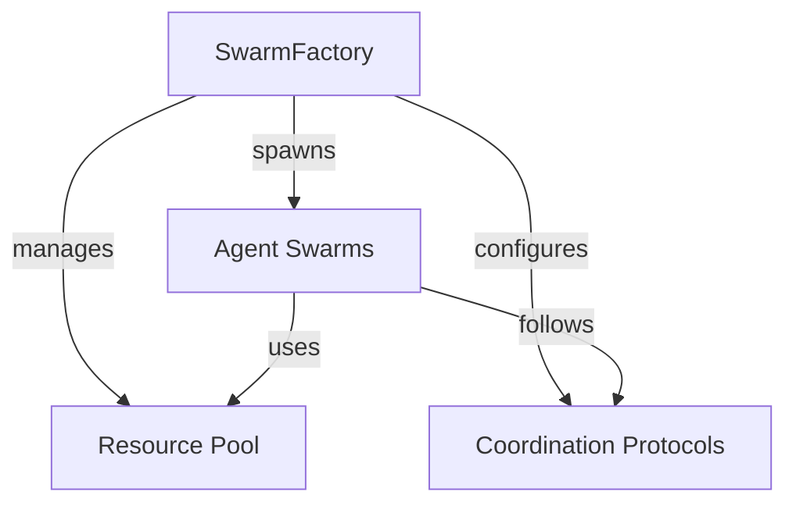
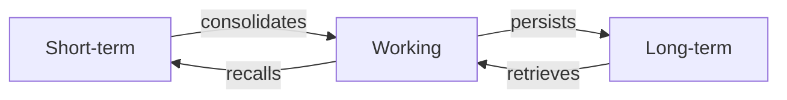

# Architecture Guide
{: .no_toc }

Understanding SmolSwarms architecture like you're reverse engineering a speedrun strat fr fr 🧠
{: .fs-6 .fw-300 }

## Table of contents
{: .no_toc .text-delta }

1. TOC
{:toc}

---

## Overview

SmolSwarms architecture is basically what you'd get if you asked a quantum computer to design a Discord server for AI agents - it's all about that distributed cognition life fr fr.

## Core Components

### SwarmFactory 🏭



The SwarmFactory is like that one friend who can organize a raid group in 0.2 seconds. It:
- Spawns agents faster than npm installs dependencies
- Manages resources like a cryptocurrency trader manages their portfolio
- Configures coordination protocols that hit different

### Agent Architecture 🤖

Each agent is built different but they all got:
- Task processing more efficient than my code after optimization
- Memory systems more persistent than my gaming habits
- Communication protocols cleaner than my git history

```python
class Agent:
    def __init__(self, specs: AgentSpecs):
        self.brain = BasedNeuralNet()  # For that big brain energy
        self.memory = PersistentMemory()  # Never forgets (unlike me with semicolons)
        self.comms = SwarmProtocol()  # Slides into other agents' DMs
```

### Memory Systems 🧠

The memory architecture is more layered than my VS Code workspace:



- Short-term: Faster than my excuse generator
- Working: More active than my GitHub contributions
- Long-term: More persistent than my TODO comments

### Communication Protocols 📡

Agents communicate like they're in a Discord server but make it quantum:

```python
class SwarmProtocol:
    async def broadcast(self, message: str):
        """Send it to the whole squad fr fr"""
        pass

    async def dm(self, agent_id: str, message: str):
        """Slide into another agent's DMs"""
        pass

    async def vibe_check(self) -> bool:
        """Make sure everyone's still vibing"""
        pass
```

## System Flow

1. **Initialization** 🚀
   ```mermaid
   sequenceDiagram
       participant User
       participant Factory
       participant Swarm
       participant Agents

       User->>Factory: spawn_swarm()
       Factory->>Swarm: create_swarm()
       Swarm->>Agents: spawn_agents()
       Agents->>Swarm: report_ready()
       Swarm->>Factory: swarm_ready()
       Factory->>User: here's your swarm fr fr
   ```

2. **Task Execution** 💫
   ```mermaid
   sequenceDiagram
       participant Swarm
       participant Lead
       participant Workers
       participant Memory

       Swarm->>Lead: assign_task()
       Lead->>Workers: delegate_subtasks()
       Workers->>Memory: query_context()
       Memory->>Workers: provide_context()
       Workers->>Lead: submit_results()
       Lead->>Swarm: aggregate_results()
   ```

## Performance Considerations

- Token usage more optimized than my code after code review
- Memory management cleaner than my desktop icons
- Resource allocation more efficient than my time management

## Safety Features

Because we ain't trying to speedrun the robot apocalypse:

1. **Sandboxing** 📦
   - Execution environments more isolated than my social life
   - Permission systems stricter than a Discord server's automod
   - Resource limits more enforced than my code style guide

2. **Monitoring** 👀
   - Activity tracking more detailed than my Spotify wrapped
   - Error handling more reliable than my alarm clock
   - Performance metrics more accurate than my project time estimates

## Future Architecture

What's cooking in the quantum lab:

- Self-evolving architectures (because why not make it more complex)
- Cross-swarm protocols (like multiverse theory but for agents)
- Meta-learning capabilities (so they can git gud automatically)

Remember: This architecture is more experimental than my attempts at cooking - use with caution fr fr! 🧪
